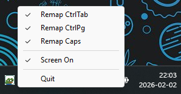
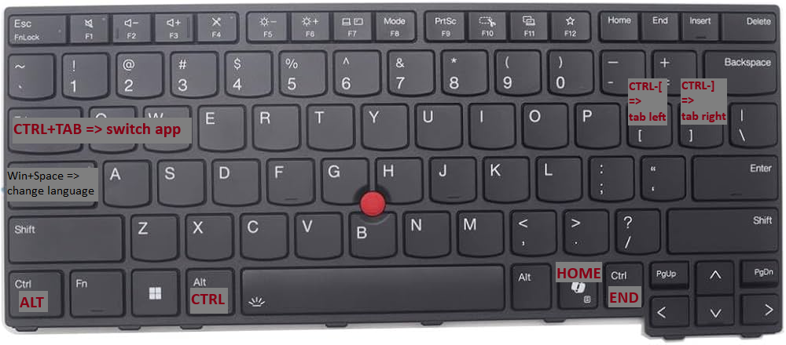

# CtrlAltTab



The tool remaps some windows _shortcuts_. Simple replacement for powertoys keyboard manager

\* _only_ shortcuts because single key remap is much better via `Scancode Map` or SharpKeys

- `Alt-Tab` for Ctrl-Tab, supports multi tab switch. Could be useful is you swap `Ctrl<=>Alt`
- `Ctrl+\[` / `]`, to Ctrl+PageUp / PageDown
- `Caps` to Alt+Shift # Language switch
- `Win+Shift+F23` to home # lenovo AI key. Good is right ctrl is mapped to `End`
- `Screen-On` functionality
- tray menu
- saves settings in registry `HKEY_CURRENT_USER\SOFTWARE\CtrlAltDel`
- autorun switch

## preparation

I prefer to remap single keys via windows registry value `Scancode Map`, that is why I use ctrlalttab with the following regedit:

```
alt <=> ctrl
rctrl => end
ralt => home
rmenu => home
home => print screen (maybe will remove)
```

amend it for your own needs or use sharpkeys for the same needs

```
reg add "HKLM\SYSTEM\CurrentControlSet\Control\Keyboard Layout" /v "Scancode Map" /t REG_BINARY /d 0000000000000000070000001D00380038001D004FE01DE047E038E047E05DE037E047E000000000
```

# final layout


## requirements
- Windows
- Nim 2.0.8

## build
```
nimble build -d:release -d:strip --opt:size --app:gui
```

or using zig cc (to avoid win defender)
```
nimble build --cc:clang --clang.exe="zigcc.cmd" --clang.linkerexe="zigcc.cmd" -d:release -d:strip --opt:size --app:gui
```
